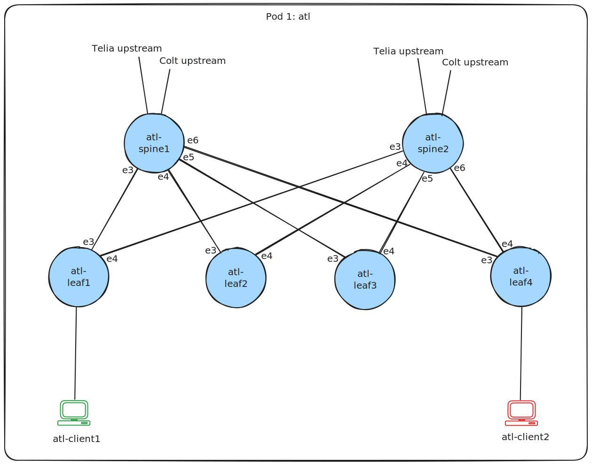

<!-- markdownlint-disable -->

<!-- markdownlint-restore -->

# Infrahub by OpsMill

[Infrahub](https://github.com/opsmill/infrahub) by [OpsMill](https://opsmill.com) acts as a central hub to manage the data, templates and playbooks that powers your infrastructure. At its heart, Infrahub is built on 3 fundamental pillars:

- **A Flexible Schema**: A model of the infrastructure and the relation between the objects in the model, that's easily extensible.
- **Version Control**: Natively integrated into the graph database which opens up some new capabilities like branching, diffing, and merging data directly in the database.
- **Unified Storage**: By combining a graph database and git, Infrahub stores data and code needed to manage the infrastructure.

## Infrahub - Demo repository for a DC



This repository is demoing the key Infrahub features for an example data center with VxLAN/EVPN and firewalls. It demonstrates the capabilities to use Infrahub with Arista AVD. Infrahub generates configurations that AVD deploys.

You can run this demo on your pc using docker, or using Github Codespaces.

## Running the demo on your pc

### Set environment variables

```shell
export INFRAHUB_ADDRESS="http://localhost:8000"
export INFRAHUB_API_TOKEN="06438eb2-8019-4776-878c-0941b1f1d1ec"
export CEOS_DOCKER_IMAGE="9r2s1098.c1.gra9.container-registry.ovh.net/external/ceos-image:4.29.0.2F"
export LINUX_HOST_DOCKER_IMAGE="9r2s1098.c1.gra9.container-registry.ovh.net/external/alpine-host:v3.1.1"
```

### Install the Infrahub SDK

```shell
poetry install --no-interaction --no-ansi --no-root
```

### Start Infrahub

```shell
poetry run inv start
```

### Load schema and data into Infrahub

This will create :

- Basics data (Account, organization, ASN, Device Type, and Tags)
- Locations data (Locations, VLANs, and Prefixes)
- Topology data (Topology, Topology Elements)
- Security data (Policies, rules, objects)

```shell
poetry run inv load-schema load-data
```

## Running the demo in Github Codespaces

[Spin up in Github codespace](https://codespaces.new/opsmill/infrahub-demo-dc-fabric-develop)

## Demo flow

### 1. Add the repository into Infrahub (Replace GITHUB_USER and GITHUB_TOKEN)

> [!NOTE]
> Reference the [Infrahub documentation](https://docs.infrahub.app/guides/repository) for the multiple ways this can be done.

```graphql
mutation AddCredential {
  CorePasswordCredentialCreate(
    data: {
      name: {value: "my-git-credential"},
      username: {value: "<GITHUB_USERNAME>"},
      password: {value: "<GITHUB_TOKEN>"}
    }
  ) {
    ok
    object {
      hfid
    }
  }
}


mutation AddRepository{
  CoreRepositoryCreate(
    data: {
      name: { value: "infrahub-demo-dc-fabric" }
      location: { value: "https://github.com/opsmill/infrahub-demo-dc-fabric.git" }
      # The HFID return from the previous mutation. Will be the name of the credentials
      credential: { hfid: "my-git-credential" }
    }
  ) {
    ok
    object {
      id
    }
  }
}
```

### 2. Generate a Topology (Device, Interfaces, Cabling, BGP Sessions, ...)


> [!NOTE]
> The example below creates the topology fra05-pod1

```shell
poetry run infrahubctl run generators/generate_topology.py topology=fra05-pod1
```

### 3. Generate a network service in a Topology

> [!NOTE]
> The example below creates the Layer2 network service and a another Layer3 on topology fra05-pod1

```shell
poetry run infrahubctl run generators/generate_network-services.py topology=fra05-pod1 type=layer2
poetry run infrahubctl run generators/generate_network-services.py topology=fra05-pod1 type=layer3 vrf=production
```

### 4. Render Artifacts

Artifact Generation is not currently present in the UI but it's possible to try it out locally :

> [!NOTE]
> This command will render the artifact define with `device_arista` Transformation, for `fra05-pod1-leaf1` device

```shell
poetry run infrahubctl render device_arista device=fra05-pod1-leaf1
```

### 5. Try out our pytest plugin

> [!NOTE]
> The command will use our infrahub pytest plugin. It will run the different test in the `tests` folder. Those tests included :
>
> - Syntax checks for all the GraphQL Queries
> - Syntax checks for the Checks
> - Syntax checks for all the jinja files used in `templates`
> - will use the input/output file to try out the rendering and confirm there is no unexpected missing piece

```shell
pytest -v ./tests
```

### 6. Create a new Branch

Create directly a new branch `test` in the UI, or if you prefer to use our SDK in CLI :

```shell
poetry run infrahubctl branch create test --sync-with-git
```

### 7. Create new Network Services and Regenerate Artifacts in your branch

> [!NOTE]
> You will be able to see the Diff in the Branch not only about the Data but about the Artifact as well
> You can go back in time to see the Diff on the branch before you create the new services (you can do it `main` after merging the proposed changes too)

### 8. Create a proposed change

Using your new branch `test` you will be able to see the Diff in the Proposed Change and you will see the checks / tests in the CI pipeline

### 9. Try out  the topology check

- Modify an Elements in a Topology (example: increase or decrease the quantity of leaf switches in fra05-pod1)

- The checks will run in the Proposed Changes -> check_device_topology will fail.

### 10. Deploy your environment to containerlabs

The containerlab generator automatically generates a containerlab topology artifact for every topology. Every device has its startup config as an artifact.

```shell
# Download all artifacts automatically to ./generated-configs/
poetry run python3 scripts/get_configs.py

# Start the containerlab
sudo -E containerlab deploy -t ./generated-configs/clab/fra05-pod1.yml --reconfigure
```
