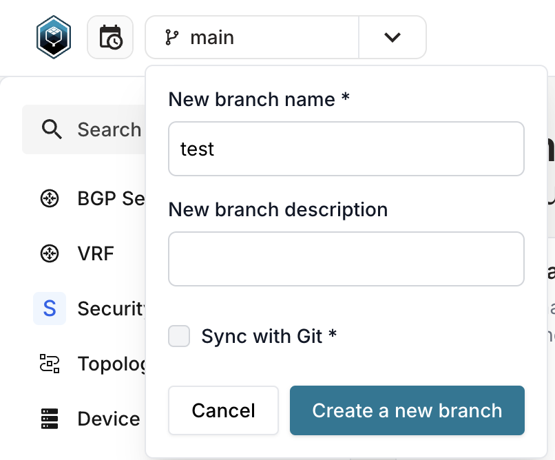

import CodeBlock from '@theme/CodeBlock';
import block1 from '!!raw-loader!./code_snippets/0001_graphql_add_repo.gql';
import block2 from '!!raw-loader!./code_snippets/0002_shell_run_generator.sh';

This repository demos key Infrahub features using an example data center running VxLAN / EVPN and firewalls. It demonstrates the capabilities to use Infrahub with Arista AVD and Containerlab. Infrahub generates configurations that AVD deploys to a Containerlab topology.


## Running the demo

### Clone the repository

Clone the GitHub repository to the server you will run this demo on:

```shell
git clone https://github.com/opsmill/infrahub-demo-dc-fabric.git
```

### Prerequisites

Before you get started, make sure the following tools are installed:

- ✅ **Infrahub Docker Compose Requirements**
  Follow the [Infrahub installation guide](https://docs.infrahub.app/guides/installation#using-curl-and-docker-compose) to set up the necessary Docker Compose environment.

- 🐍 **Poetry**
  Install Poetry by following the [official installation guide](https://python-poetry.org/docs).

- 🧪 **Containerlab (For Lab Testing)**
  If you plan to run lab topologies, you'll also need [Containerlab](https://containerlab.dev/install/).

### Set environmental variables

```shell
export INFRAHUB_ADDRESS="http://localhost:8000"
export INFRAHUB_API_TOKEN="06438eb2-8019-4776-878c-0941b1f1d1ec"
export CEOS_DOCKER_IMAGE="registry.opsmill.io/external/ceos-image:4.29.0.2F"
export LINUX_HOST_DOCKER_IMAGE="registry.opsmill.io/external/alpine-host:v3.1.1"
```

### Install the Infrahub SDK

Our demos use [poetry](https://python-poetry.org/) to manage the Python environment.

```shell
poetry install --no-interaction --no-ansi --no-root
```

### Start Infrahub

```shell
poetry run invoke start
```

### Load schema and data into Infrahub

The `invoke` command will create:

- Basic data (Account, organization, ASN, Device Type, and Tags)
- Location data (Locations, VLANs, and Prefixes)
- Topology data (Topology, Topology Elements)
- Security data (Policies, rules, objects)

```shell
poetry run invoke load-schema load-data
```

## Demo flow

### 1. Add the repository into Infrahub via GraphQL

:::note

Reference the [Infrahub documentation](https://docs.infrahub.app/guides/repository) for the multiple ways this can be done.

:::

<CodeBlock language="graphql">{block1}</CodeBlock>

### 2. Generate a topology (devices, interfaces, cabling, BGP sessions, ...)

:::note

The example below creates the topology fra05-pod1

:::

<CodeBlock language="bash">{block2}</CodeBlock>

### 3. Create a branch

#### Via the UI



### 4. Create a new l2 or l3 service

In the menu navigate to **Network Service** > **Network Service** and click on the **Add Network Service** button
[http://localhost:8000/objects/TopologyNetworkService](http://localhost:8000/objects/TopologyNetworkService)


:::note

The example below creates the Layer2 network service and a another Layer3 on topology fra05-pod1

:::

### 5. Add the newly created service to the `network_services` group

In the menu navigate to **Object Management** > **Groups**.

Search for the group `network_services` and click on it to open the group's detailed view.

Open the **members** tab, click the **Add Members** button and add your newly created L2 or L3 network service.

### 6. Create a proposed change


:::note

This command will run the generator and render the artifacts

:::


### 7. Try out our pytest plugin

:::note

The command will use our Infrahub pytest plugin. It will run the different test in the `tests` folder. These tests include:

- Syntax checks for all the GraphQL Queries
- Syntax checks for the Checks
- Syntax checks for all the jinja files used in `templates`
- will use the input/output file to try out the rendering and confirm there is no unexpected missing piece

:::

```shell
pytest -v ./tests
```

### 8. Create a new Branch

Create a new branch `test2` in the UI, or if you prefer to use our SDK in CLI:

```shell
poetry run infrahubctl branch create test2
```

### 9. Try out  the topology check

- Modify an Element in a Topology (example: increase or decrease the quantity of leaf switches in fra05-pod1)

- The checks will run in the Proposed Change -> `check_device_topology` will fail.

### 10. Deploy your environment to ContainerLabs

Infrahub automatically generates a Containerlab topology for each defined topology. This topology is attached as an artifact to the corresponding topology object. Each device also includes its own startup configuration, stored as a separate artifact.

Using the Containerlab CLI, we can deploy the lab—this spins up all devices as Docker containers and loads their respective startup configurations.

```shell
# Download all artifacts automatically to ./generated-configs/
poetry run python3 scripts/get_configs.py

# Start the Containerlab
sudo -E containerlab deploy -t ./generated-configs/clab/fra05-pod1.yml --reconfigure
```

Now you can log in from any device with your SSH client!

:::important

username: `admin` - password: `admin`

DNS entries follow this pattern: `clab-demo-dc-fabric-$nodeName`

:::

```shell
ssh admin@clab-demo-dc-fabric-fra05-pod1-spine1
(admin@clab-demo-dc-fabric-fra05-pod1-spine1) Password:

fra05-pod1-spine1>
```
