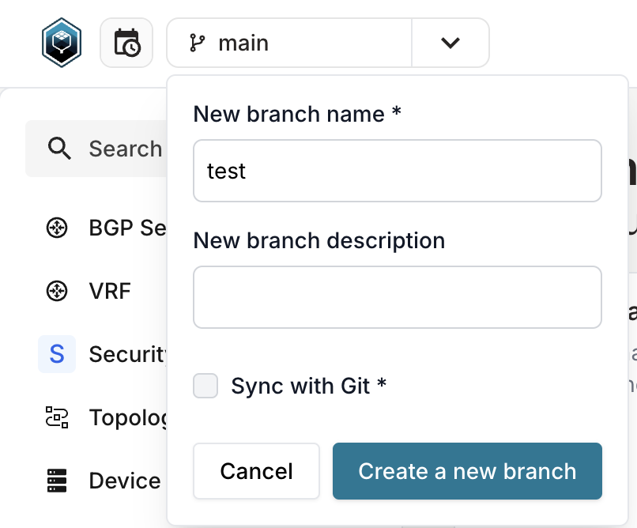
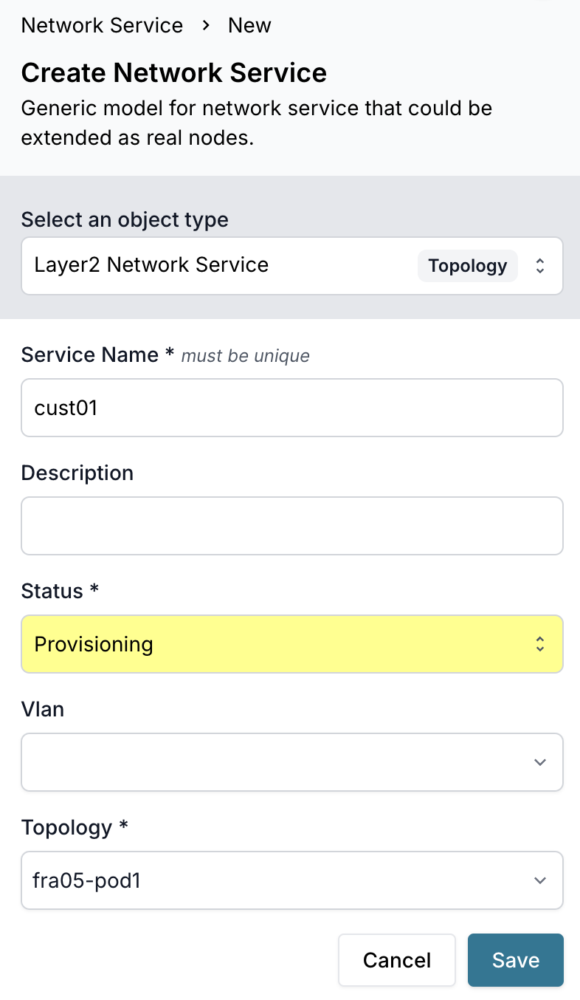
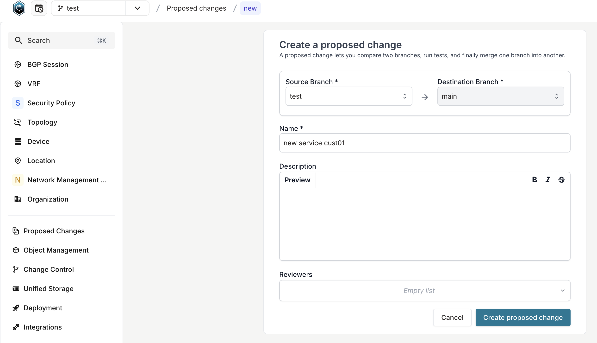
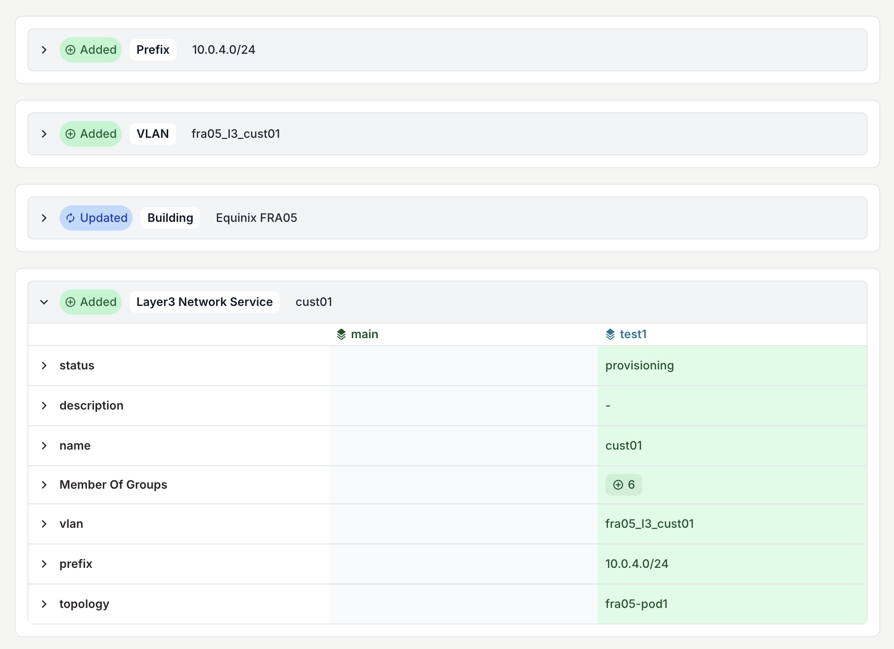
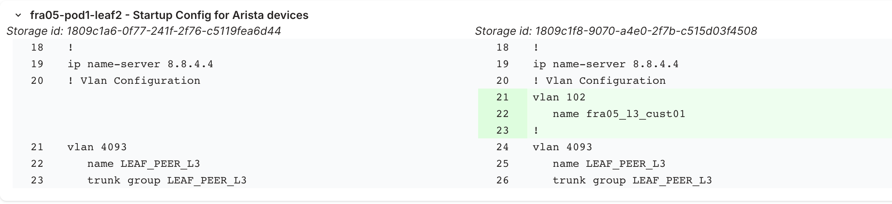

import CodeBlock from '@theme/CodeBlock';
import Tabs from '@theme/Tabs';
import TabItem from '@theme/TabItem';
import block1 from '!!raw-loader!./code_snippets/0001_graphql_add_repo.gql';
import block2 from '!!raw-loader!./code_snippets/0002_shell_run_generator.sh';

This tutorial guides you through using the Infrahub DC fabric demo as an end-user. You'll learn how to generate a network topology, create network services, and deploy configurations to a virtual lab environment.

## What you'll learn

By completing this tutorial, you'll understand how to:

- Add a Git repository to Infrahub
- Generate a complete network topology
- Create and manage branches for change control
- Add Layer 2 and Layer 3 network services
- Create proposed changes and review diffs
- Deploy configurations to Containerlab

## Before you begin

Complete the [installation guide](./install.mdx) to ensure your environment is ready.

You should have:

- Infrahub running at [http://localhost:8000](http://localhost:8000)
- Schema and initial data loaded
- Environment variables configured
- Containerlab installed (optional, for deployment testing)

## Step 1: Add the repository to Infrahub

Infrahub needs access to this repository to execute generators, checks, and transforms. Add it via GraphQL or the UI.

<Tabs>
  <TabItem value="graphql" label="Via GraphQL">

Navigate to the GraphQL explorer at [http://localhost:8000/graphql](http://localhost:8000/graphql) and execute:

<CodeBlock language="graphql">{block1}</CodeBlock>

  </TabItem>
  <TabItem value="ui" label="Via the UI">

1. Navigate to **Unified Storage** > **Repositories**
2. Click **Add Repository**
3. Fill in the details:
   - **Name**: `infrahub-demo-dc-fabric`
   - **Location**: `https://github.com/opsmill/infrahub-demo-dc-fabric.git`
   - **Commit**: `main` (or your current branch)
4. Click **Save**

  </TabItem>
</Tabs>

:::tip
Infrahub clones the repository and makes all scripts, templates, and queries available for use.
:::

## Step 2: Generate a network topology

The demo includes a topology generator that creates devices, interfaces, cabling, and BGP sessions based on topology definitions.

### Run the generator

Generate the `fra05-pod1` topology using the CLI:

<CodeBlock language="bash">{block2}</CodeBlock>

This generator:

- Reads the topology definition for `fra05-pod1`
- Creates spine and leaf switches based on topology elements
- Generates interfaces for each device
- Creates physical connections between devices
- Configures BGP sessions between neighbors
- Adds devices to the topology group

### Verify the topology was created

Navigate to **Infrastructure** > **Devices** in the UI at [http://localhost:8000/objects/InfraDevice](http://localhost:8000/objects/InfraDevice).

You should see devices like:

- `fra05-pod1-spine1`, `fra05-pod1-spine2`, etc.
- `fra05-pod1-leaf1`, `fra05-pod1-leaf2`, etc.

Click on a device to explore its interfaces, connections, and BGP configuration.

## Step 3: Create a branch

Before making changes, create a branch to isolate your work.

<Tabs>
  <TabItem value="ui" label="Via the UI">

1. Click the **Branch** dropdown in the top navigation
2. Click **Create Branch**
3. Enter a branch name (for example, `add-network-services`)
4. Optionally add a description
5. Click **Create**



  </TabItem>
  <TabItem value="cli" label="Via the CLI">

```bash
poetry run infrahubctl branch create add-network-services
```

  </TabItem>
</Tabs>

:::info
All subsequent changes will be made in this branch until you switch back to main.
:::

## Step 4: Create a Layer 2 network service

Network services represent VLANs that span multiple devices in the topology.

### Add the service

1. Navigate to **Network Service** > **Network Service** at [http://localhost:8000/objects/TopologyNetworkService](http://localhost:8000/objects/TopologyNetworkService)
2. Click **Add Network Service**
3. Fill in the details:
   - **Name**: `customer-vlan-100`
   - **Type**: `Layer2`
   - **Topology**: Select `fra05-pod1`
   - **Description**: `Customer VLAN for tenant isolation`
   - **VLAN ID**: `100` (optional, can be auto-allocated)
4. Click **Save**



## Step 5: Add the service to the generator group

For the generator to process this service, add it to the `network_services` group.

### Add to the group

1. Navigate to **Object Management** > **Groups** at [http://localhost:8000/objects/CoreStandardGroup](http://localhost:8000/objects/CoreStandardGroup)
2. Search for `network_services` and click to open it
3. Click the **Members** tab
4. Click **Add Members**
5. Search for your service (`customer-vlan-100`) and select it
6. Click **Add**

:::note
The `network_services` group is a trigger point. When you add a service to this group, the generator automatically creates VLANs, IP prefixes, and addresses when a proposed change is created.
:::

## Step 6: Create a proposed change

Proposed changes are how you review and merge branch changes into main.

### Create the proposed change

1. Click the **Branch** dropdown in the top navigation
2. Click **Create Proposed Change**
3. Review the changes Infrahub detected
4. Add a title (for example, `Add customer VLAN 100`)
5. Optionally add a description
6. Click **Create**



### What happens next

When you create the proposed change:

- The `network_services` generator runs automatically
- It allocates IP prefixes from the location's resource pool
- It creates VLANs on appropriate devices
- It assigns IP addresses to device interfaces
- Configuration artifacts are regenerated with the new service

### Review the diff

In the proposed change view:

1. Click the **Data** tab to see object-level changes
2. Click the **Artifacts** tab to see configuration diffs

You should see:

- New VLAN objects created
- New IP prefix allocations
- Updated device configurations including the new VLAN




## Step 7: Add a Layer 3 network service

Layer 3 services include routing and IP addressing in addition to VLANs.

### Create the L3 service

1. Navigate to **Network Service** > **Network Service**
2. Click **Add Network Service**
3. Fill in the details:
   - **Name**: `app-servers-vlan-200`
   - **Type**: `Layer3`
   - **Topology**: Select `fra05-pod1`
   - **VRF**: Select `Production`
   - **Description**: `Application server segment`
4. Click **Save**

### Add to the generator group

Follow the same process as step 5 to add this service to the `network_services` group.

### Update the proposed change

The proposed change automatically detects new changes in your branch. Refresh the view to see:

- Additional VLAN objects
- Routed IP prefixes with gateway addresses
- Updated device configurations with SVIs (switched virtual interfaces)

## Step 8: Merge the proposed change

Once you've reviewed the changes and they look correct:

1. In the proposed change view, click **Merge**
2. Confirm the merge
3. Infrahub merges your branch into main

Your network services are now part of the main branch and will be included in all future configuration generation.

:::warning
Before merging, ensure all checks pass. If `check_device_topology` or other checks fail, investigate and resolve the issues.
:::

## Step 9: Test with Containerlab (optional)

Deploy your configurations to a virtual lab to test them.

### Download artifacts

Run the script to download all generated configurations:

```bash
poetry run python3 scripts/get_configs.py
```

This creates a `generated-configs/` directory with:

- Device startup configurations
- Containerlab topology file

### Deploy the lab

Start the Containerlab topology:

```bash
sudo -E containerlab deploy -t ./generated-configs/clab/fra05-pod1.yml --reconfigure
```

This command:

- Creates Docker containers for each device
- Loads the startup configurations
- Connects containers based on the topology

:::important
Default credentials:

- **Username**: `admin`
- **Password**: `admin`

DNS entries follow the pattern: `clab-demo-dc-fabric-$nodeName`
:::

### Verify connectivity

SSH to a device and verify the configuration:

```bash
ssh admin@clab-demo-dc-fabric-fra05-pod1-spine1
```

Check that VLANs exist:

```bash
show vlan
```

Check BGP neighbors:

```bash
show ip bgp summary
```

### Destroy the lab

When finished testing, destroy the Containerlab topology:

```bash
sudo containerlab destroy -t ./generated-configs/clab/fra05-pod1.yml
```

## Step 10: Experiment with topology validation

The demo includes a check that validates device counts match topology definitions.

### Trigger a validation failure

1. Create a new branch: `test-validation`
2. Navigate to **Topology** > **Topology** at [http://localhost:8000/objects/TopologyTopology](http://localhost:8000/objects/TopologyTopology)
3. Click on `fra05-pod1`
4. Click on **Elements** tab
5. Find the element for leaf switches
6. Change the **Quantity** from `8` to `6`
7. Click **Save**
8. Create a proposed change

### Review the check failure

In the proposed change view:

1. Navigate to the **Checks** tab
2. You should see `check_device_topology` with a failure status
3. Click to view the error details

The check reports: "Expected 6 leaf switches, found 8 in group."

This demonstrates how checks prevent inconsistencies from being merged.

### Fix the issue

Either:

- Revert the quantity back to `8`, or
- Delete the extra leaf devices to match the new quantity

The check will pass once reality matches the topology definition.

## What you've learned

Through this walkthrough, you've experienced:

- The Git integration workflow
- Topology generation from abstract definitions
- Branch-based change management
- Network service creation and automation
- Proposed change review and merging
- Artifact generation for configuration deployment
- Validation checks enforcing data consistency
- Virtual lab deployment for testing

## Next steps

- Explore the [developer guide](./developer-guide.mdx) to understand how generators and transforms work
- Review the [concepts](./concepts.mdx) for deeper architectural understanding
- Experiment with creating custom security policies
- Modify templates to customize configuration output
- Create additional topologies for different locations

## Troubleshooting

### Generator doesn't run

- Ensure the repository is added to Infrahub
- Verify the service is in the `network_services` group
- Check that you created a proposed change (generators run during PC creation)

### No prefix allocated

- Verify resource pools exist for the location (`supernet-fra05`)
- Check that pools have available address space
- Review generator logs for allocation errors

### Containerlab deployment fails

- Ensure Docker images are available (check `CEOS_DOCKER_IMAGE` env var)
- Verify sufficient system resources (CPU, memory, disk)
- Check for port conflicts with other running containers
- Review Containerlab logs: `sudo containerlab inspect -t ./generated-configs/clab/fra05-pod1.yml`

### Proposed change won't merge

- Resolve all failing checks first
- Review conflicts if another user modified the same objects
- Ensure you have write permissions on the branch
